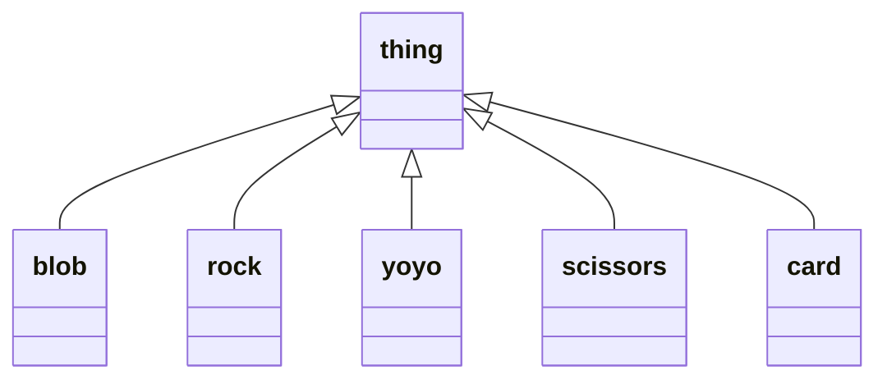

# Software Architecture Diagramming Tooling Discovery
The following post is a collection of notes, links and learnings asscoaited with a review of various diagraming tools available to be used to document software architeture.

## Needs Analsis 
The following 
* easy to use
* UML diagrams
* relatively cheap (actually is it available for free)
* text based to diagrams as code concepts
* visual studio code previewer
* support for [C4 Modelling](https://c4model.com/) would be nice
* render in mark down 
* render in github pages
* render in confluence
* layers

## Tooling Reviewed
The following tools have been reviewed:
* PlantUML
* Diagram.net (previously DrawIO)
* Mermaid
* Lucidchart
* Structurizr
* Gliffy

---
**NOTE**

Sparks Enterprise

---

## Comparison Summary

| Need | PlantUML | DrawIO | Mermaid | Lucidchart| Structurizr | Gliffy | 
| --- | --- | --- | --- | --- | --- |--- |
| Easy To Use | Yes | Yes | Yes | Yes | No | No |
| UML | Yes | Yes | Yes | Yes | Yes | Yes |
| Free | Yes | Yes | Yes | No | No | No|
| Text Based | Yes | Yes | Yes | | Yes | No |
| Visual Studio Code | Yes | Yes | Yes | | | No |
| C4 Models | Yes | Yes | Sort of | | | No |
| Markdown | Yes | Yes | Yes | | | No |
| Github Pages | ? | via SVG | Yes | | via SVG | via SVG| 
| Confluence | Yes | Yes | Yes |? | Yes | Yes|
| Layers | No | Yes | ? | No | No | Yes |

More details follows for each tool reviewed.

---

### [PlantUML](https://plantuml.com/)
[Jebbs VSC extension ](https://marketplace.visualstudio.com/items?itemName=jebbs.plantuml) has a 5 star rating and provides the ability to preview, save diagrams as svg/png.

The following extension setting allow you to render the the plantuml script when previewing markdown document. 

If you feel OK to share your models you can use the official server https://www.plantuml.com/plantuml. The alernative is to setup you own server which is beyond the scope of this article.

```code
"plantuml.server": "https://www.plantuml.com/plantuml"
```

C4 Modelling is supported via the inclusion of [plantuml-stdlib](https://github.com/plantuml-stdlib) into your script.

```code
@startuml Basic Sample
!include https://raw.githubusercontent.com/plantuml-stdlib/C4-PlantUML/master/C4_Container.puml

Person(admin, "Administrator")
System_Boundary(c1, "Sample System") {
    Container(web_app, "Web Application", "C#, ASP.NET Core 2.1 MVC", "Allows users to compare multiple Twitter timelines")
}
System(twitter, "Twitter")

Rel(admin, web_app, "Uses", "HTTPS")
Rel(web_app, twitter, "Gets tweets from", "HTTPS")
@enduml
```

The above script sourced from https://github.com/plantuml-stdlib/C4-PlantUML#readme renders within the markrkdown document as...

```plantuml
@startuml Basic Sample
!include https://raw.githubusercontent.com/plantuml-stdlib/C4-PlantUML/master/C4_Container.puml

Person(admin, "Administrator")
System_Boundary(c1, "Sample System") {
    Container(web_app, "Web Application", "C#, ASP.NET Core 2.1 MVC", "Allows users to compare multiple Twitter timelines")
}
System(twitter, "Twitter")

Rel(admin, web_app, "Uses", "HTTPS")
Rel(web_app, twitter, "Gets tweets from", "HTTPS")
@enduml
```
Linking is possbile by including [hypertext links](https://plantuml.com/link) on objects.. So it is possible to add but it is fragile and not really testable within Visual Studio Code.

PlantUML is not so good at big complex diagrams. It is possible to add layout hints to the diagram but at times the results are bewildering. Maybe this is a excellent case for keeping the diagrams simple. 

### [Diagram.net](https://www.diagrams.net/)

See [Visual Studio marketplace](https://marketplace.visualstudio.com/items?itemName=hediet.vscode-drawio) for the 5 star unofficial extension which integrates Draw.io (also known as diagrams.net) into VS Code.

A simple and easy interface to allow you to create and edit [multi layer](https://drawio-app.com/draw-io-training-exercise-7-create-a-diagram-with-layers-and-images/) SVG files and imbed them into your GIT markdown documents.

And with the help of the [C4-Draw.io plugin](https://tobiashochguertel.github.io/c4-draw.io/) you can get a head start on creating navigatable C4 models in no time.

 

### [Mermaid](https://mermaid-js.github.io/mermaid/#/n00b-gettingStarted)

The [Markdown Preview Mermaid Support visual studio code extension](
https://marketplace.visualstudio.com/items?itemName=bierner.markdown-mermaid) makes is easy to script out a diagram and render it within your markdown document while in Visual stodio code.

```code
classDiagram
hideEmpty
class thing
thing <|-- blob
thing <|-- rock
thing <|-- yoyo
thing <|-- scissors
thing <|-- card
```

A [confluence plug-in]( https://marketplace.atlassian.com/apps/1214124/mermaid-plugin-for-confluence?tab=overview&hosting=server) exists but I didn't review it.

- [ ] check rendering in git

### [Lucidchart](https://www.lucidchart.com/)

sign up for free
and then work out your plan startong from $10 per month per user?
great range of diagrams

### [Structurizr](https://structurizr.com/)
Structurizr is a collection of tooling to create software architecture diagrams and documentation based upon the [C4 model](https://c4model.com/). 

This tooling is more than a diagraming tool. It effectivley becomes an asset and component regisiter where you define an asset and then use it in one or more diagrams. 

Structurizr focus is on C1 to C3.. ie Context-Container-Component. The `code` level diagrams however appears to be handed off to code based IDEs.

Pricing starts at $5 per month for cloud hosted workspaces.

Diagrams as code can be suported via the 
[C4 DSL Extension](https://marketplace.visualstudio.com/items?itemName=systemticks.c4-dsl-extension).

Models can be published to [confluence]( https://structurizr.com/help/atlassian-confluence) via HTML iframe macro or the [structurizr macro](https://marketplace.atlassian.com/vendors/1213399). Alternatively it is possible to export models in PlantUML, C4-PlantUML and Mermaid formats. 

The tool is well documented and sample [C4 DSL](https://gitlab.com/systemticks/c4-grammar/-/tree/master/workspace) is available. The learning curve from this tool is steeper than all the tools above. 

My review of Structurizr stops here. I did not create any models using the DSL extension nor atempt to publish/render diagrams.

### [Gliffy](https://www.gliffy.com/)
Handy if you do all your authoring and collaboration in confluence. You can knock up a diagram using a graphical user interface, shape libraries and connectors.

Supports [C4 Modelling](https://www.gliffy.com/blog/c4-model) using basic shapes. Looks like you would need to create your own diagram to be used as a template. Navigation between C4 Layers can be accomplished via using diagram layers.

The gliffy UI manages document revisions.

I assume I can export SVG from the gliffy and render in a markdown document and publish on GIT. But this tooling approach fails the diagram as code requirement.

I use gliffy at work.. but not at home. There is a 2 week free trial available after which it will cost $10 per month.

