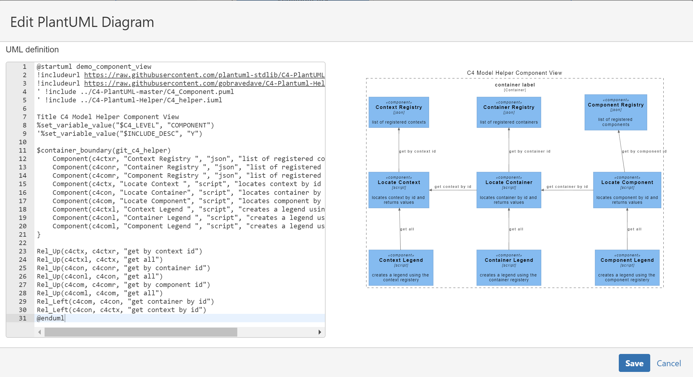
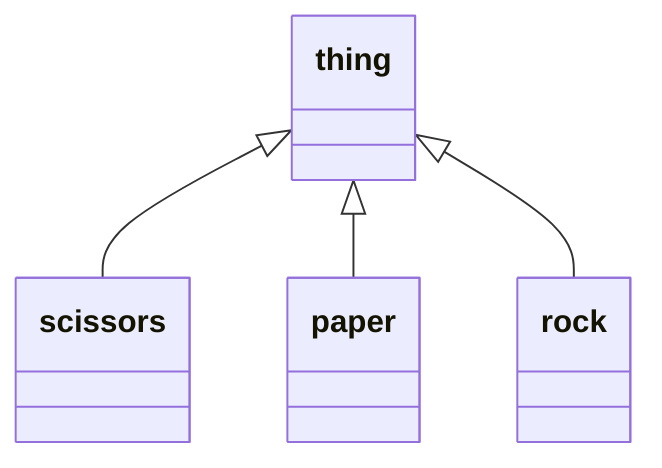

# Software Architecture Diagram Tooling Discovery
The following post is a collection of notes, links and learnings associated with a review of diagram/modelling tools to be used to create and maintain software architecture documents.

## Needs Analysis 
The following 
* easy to use
* UML diagrams
* relatively cheap (actually is it available for free)
* text based to support diagrams as code concepts
* visual studio code previewer
* support for [C4 Modelling](https://c4model.com/) would be nice
* render in mark down 
* render in github pages
* render in confluence
* add link to support navigation 
* layers to support animation would be nice

## Tooling Reviewed
The following tools have been reviewed:
* PlantUML
* Diagram.net (previously DrawIO)
* Mermaid
* Lucidchart
* Structurizr
* Gliffy

## Comparison Summary

| Need | PlantUML | DrawIO | Mermaid | Lucidchart| Structurizr | Gliffy | 
| --- | --- | --- | --- | --- | --- |--- |
| Easy To Use | Yes | No | Yes | Yes | No | No |
| UML | Yes | Yes | Yes | Yes | No | Yes |
| Free | Yes | Yes | Yes | No | No | No|
| Diagrams as Code | Yes | No | Yes | No | Yes | No |
| Visual Studio Code | Yes | Yes | Yes | No | Yes | No |
| C4 Models | Yes | Yes | Sort of | Yes | Yes | No |
| Markdown | Yes | Yes | Yes | No | via C4-Platml Export | No |
| Github Pages |  via SVG | via SVG | Yes | via SVG | via SVG | via SVG| 
| Confluence | Yes | Yes | Yes | Yes | Yes | Yes|
| Linking | Yes | Yes | Yes | Yes | Yes | Yes |
| Layers | No | Yes | No | Yes | No | Yes |

More details follow for each tool reviewed.

---

### [PlantUML](https://plantuml.com/)


[Jebbs VSC extension ](https://marketplace.visualstudio.com/items?itemName=jebbs.plantuml) has a 5 star rating and provides the ability to preview, save diagrams as svg/png.


The following extension setting allows you to render the plantuml script when previewing a markdown document in Visual Studio Code. 

```code
"plantuml.server": "https://www.plantuml.com/plantuml"
```

Only use https://www.plantuml.com/plantuml if you are OK to share your diagrams. The alternative is to setup you own server which is beyond the scope of this article.

C4 Modelling is supported via the inclusion of [plantuml-stdlib](https://github.com/plantuml-stdlib) into your script.

```code
@startuml Basic Sample
!include https://raw.githubusercontent.com/plantuml-stdlib/C4-PlantUML/master/C4_Container.puml

Person(admin, "Administrator")
System_Boundary(c1, "Sample System") {
    Container(web_app, "Web Application", "C#, ASP.NET Core 2.1 MVC", "Allows users to compare multiple Twitter timelines")
}
System(twitter, "Twitter")

Rel(admin, web_app, "Uses", "HTTPS")
Rel(web_app, twitter, "Gets tweets from", "HTTPS")
@enduml
```

The above script sourced from https://github.com/plantuml-stdlib/C4-PlantUML#readme renders within the markdown document as per screen shot, however it does not automatically render when I publish to github.

 

There is a [generate plantml](https://github.com/marketplace/actions/generate-plantuml) make action which could automate the rendering.. but this looks like it would require the plantuml script to be managed as a separate file and automates the generation of an image to being included into your markdown. I will put this on my backlog. 

Linking is possible by including [hypertext links](https://plantuml.com/link) on objects. So it is possible to add but it is fragile and is not really testable within Visual Studio Code.

The [jonashackt/plantuml-markdown](https://github.com/jonashackt/plantuml-markdown/blob/master/README.md) repository contains details on how to Integrate the PlantUML render engine into a GitHub markdown.

```code

```


If working in confluence is your thing then you will need to have the [plantuml](https://marketplace.atlassian.com/apps/1222993/flowchart-plantuml-diagrams-for-confluence?hosting=cloud&tab=overview) extension installed.

 

PlantUML is not so good at big complex diagrams. It is possible to add layout hints to the diagram but at times the results are bewildering.

### [Diagram.net](https://www.diagrams.net/)

See [Visual Studio marketplace](https://marketplace.visualstudio.com/items?itemName=hediet.vscode-drawio) for the 5 star unofficial extension which integrates Draw.io (also known as diagrams.net) into VS Code.

A simple and easy interface to allow you to create and edit [multi layer](https://drawio-app.com/draw-io-training-exercise-7-create-a-diagram-with-layers-and-images/) SVG files and imbed them into your markdown document.

And with the help of the [C4-Draw.io plugin](https://tobiashochguertel.github.io/c4-draw.io/) you can get a head start on creating navigable C4 models in no time. 

 

Technically speaking this tool does not support diagram-as-code. The underlying **drawio.svg** file is text based, however it does not look like something you could easily spot what has changed from one version to another using differencing tool.

The exported svg, however does not appear to honour the links.

### [Mermaid](https://mermaid-js.github.io/mermaid/#/n00b-gettingStarted)

The [Markdown Preview Mermaid Support visual studio code extension](
https://marketplace.visualstudio.com/items?itemName=bierner.markdown-mermaid) makes is easy to script out a diagram and render it within your markdown document while in Visual studio code.

URL links can be added using the `link` key word.

```code
classDiagram
class thing
thing <|-- scissors
thing <|-- paper
thing <|-- rock
link thing "https://gobravedave.atlassian.net/wiki/spaces/DISCOVERY/pages/425985/Mermaid+Demo" "This is a tooltip for a link to thing"
link scissors "https://gobravedave.atlassian.net/wiki/spaces/DISCOVERY/pages/819224/scissors" "This is a tooltip for a link to link to scissors"
link paper "https://gobravedave.atlassian.net/wiki/spaces/DISCOVERY/pages/753723/paper" "This is a tooltip for a link to paper"
link rock "https://gobravedave.atlassian.net/wiki/spaces/DISCOVERY/pages/655411/rock" "This is a tooltip for a link to rock"
```



Confluence is good to go with the [Mermaid confluence plug-in]( https://marketplace.atlassian.com/apps/1214124/mermaid-plugin-for-confluence?tab=overview&hosting=server). 

 

 Mermaid supports the creation of various types of diagrams. C4 Models is not one of them, however I assume you could probably roll your own via the [flowchart shapes](https://mermaid-js.github.io/mermaid/#/flowchart).

Or alternatively follow the lead shown by [Structurizr](https://structurizr.com/dsl) export as Mermaid capability. 

 
 
 This is the script generated by Structurizr.

 ```code
graph TB
  linkStyle default fill:#ffffff

  1["<div style='font-weight: bold>User</div><div style='font-size: 70%; margin-top: 0px'>[Person]</div><div style='font-size: 80%; margin-top:10px'>A user of my software system.</div>"]
  style 1 fill:#08427b,stroke:#052e56,color:#ffffff
  2["<div style='font-weight: bold'>Software System</div><div style='font-size: 70%; margin-top: 0px'>[Software System]</div><div style='font-size: 80%; margin-top:10px'>My software system.</div>"]
  style 2 fill:#1168bd,stroke:#0b4884,color:#ffffff

  1-. "<div>Uses</div><div style='font-size: 70%'></div>" .->2
```

### [Lucidchart](https://www.lucidchart.com/)

Sign up for free and then work out your plan starting from $10 per month per user?

Great range of diagrams including a [C4 Model template](https://www.lucidchart.com/pages/templates/c-4-model-example?search=c4}).

Lucidchart is pitched at being a cheaper replacement for Viso, which I am sure it is, but it missed the mark for me in being able to support the concept of diagrams-as-code.

Confluence is an option for you via the [Lucidchart Diagrams Connector](https://marketplace.atlassian.com/vendors/350257/lucid) plug-in.

I am guessing you could include links into diagrams and the output can be exported as SVG and included into markdown documents. 

### [Structurizr](https://structurizr.com/)
Structurizr is a collection of tooling to create software architecture diagrams and documentation based upon the [C4 Model](https://c4model.com/). 

This tooling is more than a diagraming tool. It effectivley becomes an asset and component regisiter where you define an asset and then use it in one or more diagrams. 

Structurizr focus is on C1 to C3.. ie Context-Container-Component. The `code` level diagrams however appears to be handed off to code based IDEs.

Pricing starts at $5 per month for cloud hosted workspaces.

Models can be published to [confluence]( https://structurizr.com/help/atlassian-confluence) via HTML iframe macro or the [structurizr macro](https://marketplace.atlassian.com/vendors/1213399). Alternatively it is possible to export models in PlantUML, C4-PlantUML and Mermaid formats. 

Diagrams as code can be supported via the 
[C4 DSL Extension](https://marketplace.visualstudio.com/items?itemName=systemticks.c4-dsl-extension).

The tool is well documented and sample [C4 DSL](https://gitlab.com/systemticks/c4-grammar/-/tree/master/workspace) is available. The learning curve from this tool is steeper than all the tools above. 

My review of Structurizr stops here. I did not create any models using the DSL extension nor atempt to publish/render diagrams in markdown and or github.

### [Gliffy](https://www.gliffy.com/)
Handy if you do all your authoring and collaboration in confluence. You can knock up a diagram using a graphical user interface, shape libraries and connectors.

No Visual Studio Code plug-in appears to be available. 

The gliffy UI manages diagram revisions by timestamp.. buit does not provide a view of what has changed.

 

Gliffy can be used to do [C4 Modelling](https://www.gliffy.com/blog/c4-model) however it is very basic. Looks like you would need to create your own diagram to be used as a template. 

Navigation between C4 Layers can be accomplished via using diagram layers or external links.

Using Layers provides a more usable experience as you can go full screen and zoom in and out of the C4 stack with out opening up new broswer tabs.

 

But not all uses cases can be solved via layers. Below shows gliffy links to confluence pages.

 

I have uploaded the 5 gliffy diagrams to this repo, or you can access them via from the [goBraveDave Confluence site](https://gobravedave.atlassian.net/wiki/spaces/DISCOVERY/pages/393252/Diagrams-As-Code+Publishing) for a head start (you are going to need it).
